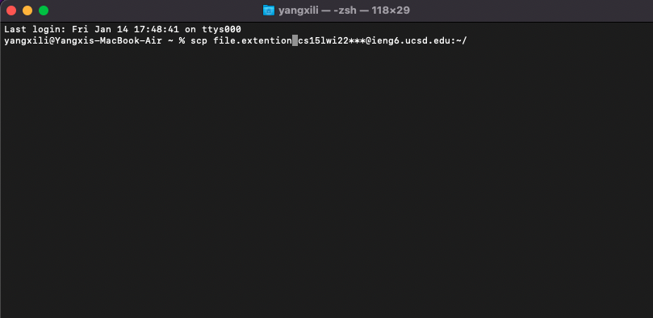

# First Lab Report

## table of contents

* [Installing VS Code](https://alanthisis.github.io/cse15l-lab-reports/lab-report-1-week-2.html#installing-vs-code)

* [Remotely Connecting](https://alanthisis.github.io/cse15l-lab-reports/lab-report-1-week-2.html#remotely-connecting)

* [Trying Some Commands](https://alanthisis.github.io/cse15l-lab-reports/lab-report-1-week-2.html#trying-some-commands)

* [Moving Files with scp](https://alanthisis.github.io/cse15l-lab-reports/lab-report-1-week-2.html#moving-files-with-scp)

* [Setting an SSH Key](https://alanthisis.github.io/cse15l-lab-reports/lab-report-1-week-2.html#setting-an-ssh-key)

* [Optimizing Remote Running](https://alanthisis.github.io/cse15l-lab-reports/lab-report-1-week-2.html#optimizing-remote-running)

---

## Installing VS Code

Visual Studio Code can be downloaded [here](https://code.visualstudio.com/).


[table of contents](https://alanthisis.github.io/cse15l-lab-reports/lab-report-1-week-2.html#table-of-contents)

---

## remotely connecting
0) If you are on windows operating system, download [openSSH](https://docs.microsoft.com/en-us/windows-server/administration/openssh/openssh_install_firstuse) for step zero.


1) Lookup your UCSD acount [here](https://sdacs.ucsd.edu/~icc/index.php).
2) Now it's time to open the terminal. With the information provided, use the command "ssh" followed by your account name. 
```
ssh cs15lwi22zz@ieng6.ucsd.edu
```
If this is your First time connecting to the server, type yes if the terminal prompted this question 
```
Are you sure you want to continue connecting (yes/no/[fingerprint])?
```
After typing your password, you would be able to connect to the server.


[table of contents](https://alanthisis.github.io/cse15l-lab-reports/lab-report-1-week-2.html#table-of-contents)

---
## trying some commands

The following are some commands for you to try.

* cd

This command changes your current directory. There are a few ways of using the "cd" command.

```
cd ~
```
This command above opens your home directory.

```
cd ~/directory/
```
This command opens the directory that you specifies. Change the part "~/directory/" to whatever directory you want.
```
cd 
```

Using cd with no following directory names takes you back to home directory.

* ls

The "ls" command allows you to view the content of your current diretory.

```
ls -l
ls -a
ls -t
ls -lat
```
For the commands above, the `-l` command list the cotent with detailed information. `-a` command list hidden files and directories. `-t` command shows items with last edited time.
* cp

* cat

[table of contents](https://alanthisis.github.io/cse15l-lab-reports/lab-report-1-week-2.html#table-of-contents)

---
## moving files with scp

The scp command is used for copying a file from your client to the server.
Use the command in your client mode.



[table of contents](https://alanthisis.github.io/cse15l-lab-reports/lab-report-1-week-2.html#table-of-contents)

---
## setting an ssh key

First of all use the command "ssh-keygen" and select a directory to store the public and private key.


Now we need to create a hidden directory ".ssh" in the server with the command `mkdir`.


Then use the "scp" command to copy the public key to the server on client. Use the appropriate path for the public key and the path on the server. 

```
scp id_rsa.pub cs15lwi22***@ieng6.ucsd.edu:~/.ssh/authorized_keys
```
[table of contents](https://alanthisis.github.io/cse15l-lab-reports/lab-report-1-week-2.html#table-of-contents)

---
## optimizing remote running

There are ways of improve the experience of working with servers.

```
$ ssh cs15lwi22***@ieng6.ucsd.edu "ls"
```
Use the commands in quotes after the ssh command will run the command in quotes on the server.

```
$ javac file.java; java file.java
```

Use semicolons to run multiple commands.

[table of contents](https://alanthisis.github.io/cse15l-lab-reports/lab-report-1-week-2.html#table-of-contents)