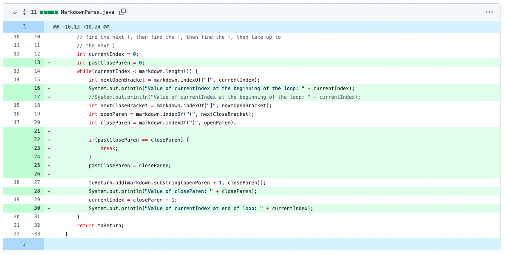

# Second Lab Report

## First Code Change

The screenshot of code change diff.

[This is the link to the infinite loop test.](https://alanthisis.github.io/markdown-parse/test-file2.md)

### description

* input - the test input did not end the file content with a link. 
* symptom - the while loop does not stop, and the method keeps running 
* bug - if the file does not end with a closing parenthesis, the currentIndex cannot get larger than the length of the testing file content, and thus the while loop keeps running

## Second Code Change

The screenshot of code change diff.

[This is the link to the image test.](https://alanthisis.github.io/markdown-parse/test-file4.md)

### description

* input - the test added some examples of images.
* symptom - the output contains image names in the returned array.
* bug - the method does not recognize the exclamation mark before images in the markdown test

## Third Code Change

[This is the link to the link at the beginning of file test.](https://alanthisis.github.io/markdown-parse/test-file3.md)

### description

* input - added links at the beginning of the markdown test file. 
* symptom - throws IndexOutOfBoundException
* bug - the program throws exception because when the file starts with open bracket, the program checks the index before the open bracket to see if it is a image