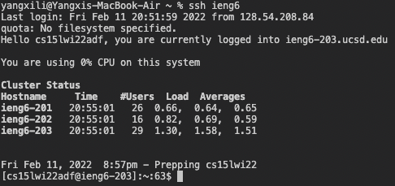
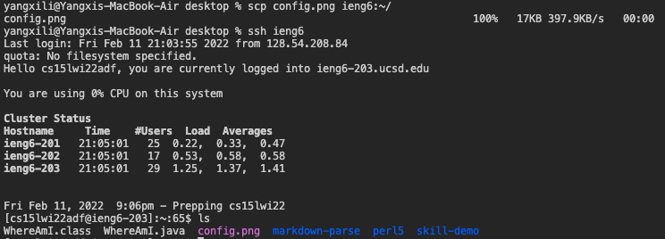

# Third Lab Report

## .ssh config file

My config file looking something like this:


## ssh command that logs me in

My login ssh command is shown below. 

```
$ ssh ieng6
```
The results are shown below.


## scp command

My scp command is shown below.

```
$ scp file-name ieng6:~/
```

I copied an image called "config.png" from desktop to my account, and then I login to my server to check if the file is there.

