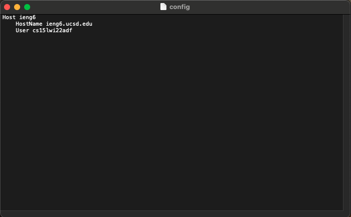

# Third Lab Report

## .ssh config file

1) First of all, I created the config file with the following commands in the .ssh directory
```
//open the .ssh directory
$cd .ssh
//create the config file
$touch config
```
now the config file is in the .ssh directory


2) then open the config file with this command:
```
$open command
```

3) My computer opens it with the textEdit app. Now all I have to do is to edit the config file with the app. My config file looking something like this:



## ssh command that logs me in

My login ssh command is shown below. 

```
$ ssh ieng6
```
The results are shown below.


## scp command

My scp command is shown below.

```
$ scp file-name ieng6:~/
```

I copied an image called "config.png" from desktop to my account, and then I login to my server to check if the file is there.

