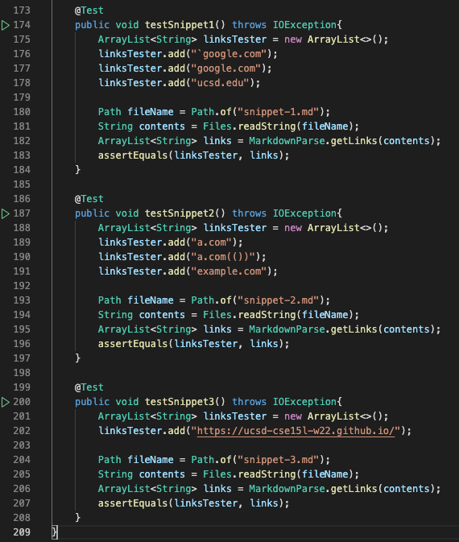
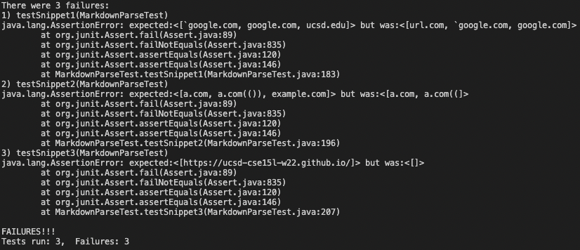
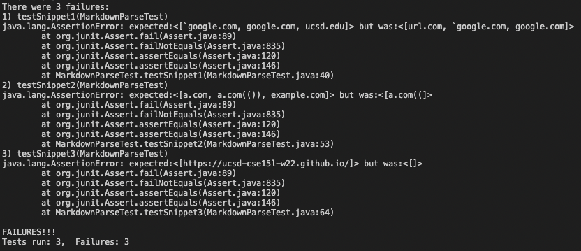

# Lab Report 4

## Markdown-Parse Repositories

My repository is [here.](https://github.com/AlanThisis/markdown-parse)

The repository that I reviewed is [here.](https://github.com/merrickqiu/markdown-parse)

## Snippet Tests
---
### Snippet 1 

* MarkdownParse should produce an ArrayList like the following for snippet 1:

```
["`google.com","google.com","ucsd.edu"]
```
* MarkdownParse should produce an ArrayList like the following for snippet 2:

```
["a.com","a.com(())","example.com"]
```
* MarkdownParse should produce an ArrayList like the following for snippet 3:

```
["https://ucsd-cse15l-w22.github.io/"]
```

## Junit Test Implementation
---
The following code is in MarkdownParseTest.java of my repo and the repo I reviewed:



* LinksTester is the expected output of MarkdownParse
* fileName contains the markdown file name
* links is the actual output of MarkdownParse getLinks method

## Outputs of Junit Test
---
### **my repo**
* the output of my repo:



* None of the snippet tests are passed.

### **review repo**
* the output of the reviewed repo:



* None of the snippet tests are passed.

## Code Changes for Snippet Tests
---

### Snippet 1

For Snippet 1, I think a small code change for getting links with inline ocde with back ticks is possible. 

**code change**
> Add an instance that contains the index of back tick. The instance should check for the indices of back ticks of each line. Under certain conditions the getLink method would return a link. 
>1) not enclosing back ticks
    >> return the link unless the back tick is in between the closing bracket and the openning parenthesis
>2) enclosing back ticks - the following are conditions when a link should be returned
    >> 1. both back ticks are within the brackets
    >> 2. both back ticks are within the parentheses
    >> 3. first back tick is in the parenthesis, and second parenthesis is after closing parenthesis

### Snippet 2

For snippet 2, I don't think a small code change for nest parentheses and brackets, because small code changes cannot help identify which brackets or parentheses are nested. Although the escaped brackets can be fixed with small code changes.

**code change**
> add an instance that contains the index of back slash, if the back slash is one index before the indices of brackets, then update the bracket index to the next closest index of bracket

### Snippet 3

For snippet 3, I think a small code change for newlines in brackets and parentheses can be made.

**code change**
> 1) check "\n" in between the brackets. If there is more than one "\n", then a link should not be returned. 
> 2) check "\n" after the closing bracket and before the openning parenthesis. If there is "\n", then the linke should not be returned.
> 3) check "/n" in the parenthesis. First trim the content inside the parenthesis. If the new line is immediately after the openning parenthesis, or immediately before the closing parenthesis, a link should be returned.


