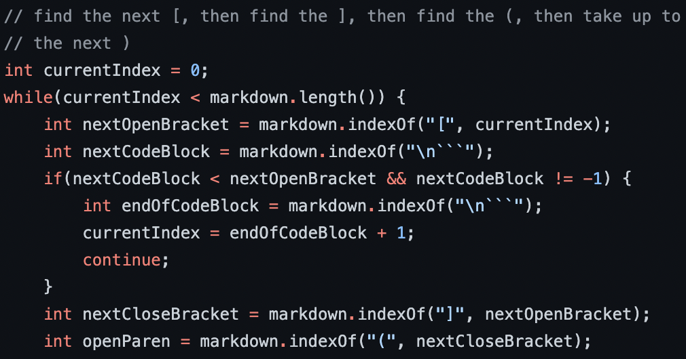
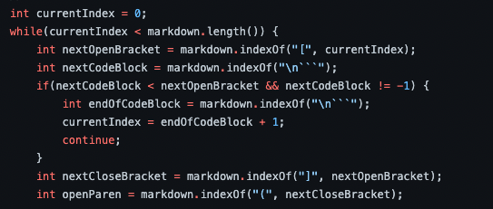

# Lab Report 5
test 194
mine []
joe [url]

test 201
mine[]
joe [baz]

## Two Tests with Different result

> The first test that is different is test 194. The output of my implementation is `[]`, while the implementation in lab 9 is `[url]`

> The second test that is different is test 201. The output of my implementation is `[]`, while the implementation in lab 9 is `[baz]`

## Finding difference

I used the diff method. Which look something like this:

```
106d105
< [url]
115d113
< [baz]
```

## Test 194

In this test, neither of the implementations are correct. 

```
[Foo*bar\]]:my_(url) 'title (with parens)'

[Foo*bar\]]
```

The actual output should be `my_(url)`

I think this test is particularly special, because it is a different type of way of embedding a link in a markdown file. The link is made by having two set of brackets with the same content in different line, and the link is the content after colons of the first set of bracket. Implementing for this test would require a big code change.



The code shown above only works for the typical type of markdown link implementation. Therefore, we need
1) add a new variable that records the index of immediate colon after closing brackets. 
2)check if there is another pair of brackets with the same content enclosed
3) if that is true, then the content immediately after the colon is the link that should be returned


## Test 201

In this test, my implementation is correct.

```
[foo]: <bar>(baz)

[foo]
```

The actual output should be `[]`

The problem of code in week 9 is that it should check for the index of any "<".



So add a variable that stores the index of "<" and check. If it is before the open parenthesis, then the content inside the parentheses should not be returned.

